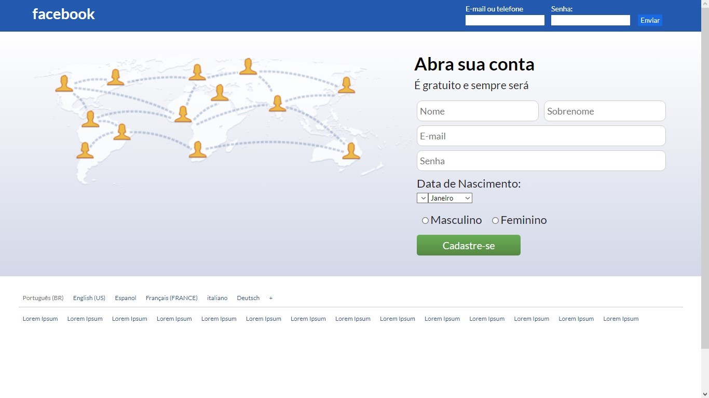

  

Front-end clone do login do facebook, repassado no curso da Danki Code Front-end.

  <a href="#-tecnologias">Tecnologias</a>&nbsp;&nbsp;&nbsp;|&nbsp;&nbsp;&nbsp;
  <a href="#-projeto">Projeto</a>&nbsp;&nbsp;&nbsp;|&nbsp;&nbsp;&nbsp;
  <a href="#-preview">Preview</a>

  
  	  

 

## 🚀 Tecnologias
Esse projeto foi desenvolvido com as seguintes tecnologias:
- [HTML5](https://html.com/)
- [CSS3](https://developer.mozilla.org/pt-BR/docs/Web/CSS)
 
 

## 📖 Projeto
Um projeto Clone do login do facebook desenvolvido no curso Front End completo da Danki Code, com as tecnologias HTML5 e CSS3, focado na pratica do uso da propriedade float, sendo totalmente responsivo.
 
 

## 🖥 Preview

  

Para testar o projeto, basta baixar o <a href="https://github.com/KevynFirst/facelogin-clone/archive/refs/heads/main.zip">arquivo</a> e extrai-lo,  Abra a pasta de extração e execute o arquivo index.html 

 

## 😉 Obrigado por visitar meu projeto

Você pode conferir outros projetos que desenvolvi aqui no meu GitHub, ou entrar em contato comigo pelos demais links.

